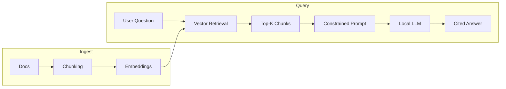
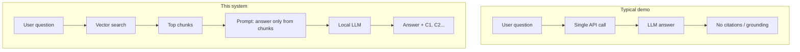

# infra-graphrag

**A locally hosted, citation-grounded DevOps documentation tutor built with Retrieval-Augmented Generation (RAG).**

This project ingests public Kubernetes documentation, converts it into embeddings, performs deterministic vector similarity search, and generates tutor-style answers using a locally hosted LLM (Ollama). All responses are grounded in retrieved evidence and include inline citations.

---

## Architecture



**Pipeline:** Docs → Chunking → Embeddings → Vector Retrieval → Constrained Prompt → Local LLM → Cited Answer

---

## What Makes This Project Strong

| Typical AI demos | This system |
|------------------|-------------|
| Call OpenAI API | **Local model (Ollama)** — no data leaves your machine |
| Send whole prompt | **Retrieval first** — only relevant chunks go to the LLM |
| Return hallucinated answer | **Grounded generation** — answer restricted to provided evidence |
| No citations | **Citation discipline** — every claim references evidence (C1, C2…) |
| Black-box ranking | **Deterministic retrieval** — cosine similarity decides evidence |



This is how **enterprise AI assistants** are built: retrieval → grounding → citation.

---

## Key Features

- **Semantic search** over infrastructure (e.g. Kubernetes) documentation  
- **Deterministic cosine similarity** retrieval  
- **Strict prompt-controlled generation** — model instructed to use only retrieved chunks  
- **Inline citation enforcement** (C1, C2, …)  
- **Local LLM hosting** — no external API calls; Ollama on your machine  
- **Hallucination mitigation** via grounding rules  

---

## What You're Learning (And Signaling to Recruiters)

| Concept | What it means here |
|--------|--------------------|
| **Embeddings** | Text → fixed-size vectors (e.g. SentenceTransformers) |
| **Vector similarity search** | Find chunks closest to the question in embedding space |
| **Cosine similarity** | Math behind ranking (dot product / norms) |
| **Chunking strategy** | Overlapping text chunks for retrieval |
| **RAG architecture** | Retrieve evidence first, then generate with an LLM |
| **Prompt engineering** | System prompts that enforce “answer only from these chunks” |
| **Grounded generation** | LLM output constrained to provided context |
| **Model hosting (Ollama)** | Run an LLM locally, no cloud dependency |
| **Safety controls** | Citation discipline and grounding reduce hallucination |

This goes well beyond *“I used the ChatGPT API.”*

---

## Important Clarification

You did **not**:

- Train a model  
- Fine-tune any weights  
- Modify model parameters  

You built a **retrieval + reasoning system** around an LLM. That distinction matters for how you describe the project.

---

## One-Sentence Summary

> A locally hosted, citation-grounded GraphRAG-style DevOps tutor that retrieves and explains Kubernetes documentation using deterministic vector search and constrained LLM generation.  
> *(Knowledge Graph integration is planned.)*

---

## Project Layout

```
infra_graphRAG/
├── apps/
│   ├── ingest/          # fetch.py (scrape docs), chunk.py (chunk → JSONL)
│   └── api/             # FastAPI: /search, /chat (RAG + citations)
├── data/
│   ├── raw/             # Fetched .txt (gitignored)
│   └── processed/       # chunks.jsonl (gitignored)
├── explore/             # Snippets to understand embeddings & cosine similarity
├── libs/
│   └── llm.py           # Ollama (or other) LLM client
├── .env.example         # Copy to .env and set OLLAMA_* etc.
└── README.md
```

---

## Quick Start

1. **Copy env and install deps**
   ```bash
   cp .env.example .env
   pip install fastapi uvicorn sentence-transformers numpy httpx pydantic pyyaml beautifulsoup4 requests  # or use project venv
   ```

2. **Ingest docs** (from project root)
   ```bash
   python apps/ingest/fetch.py
   python apps/ingest/chunk.py
   ```

3. **Run Ollama** (e.g. `ollama serve` and pull a model like `llama3.1`).

4. **Start the API**
   ```bash
   uvicorn apps.api.main:app --reload
   ```
   - **Search only:** `POST /search` with `{"q": "...", "k": 5}`  
   - **RAG with citations:** `POST /chat` with `{"q": "..."}`  
   - **Docs:** http://127.0.0.1:8000/docs  

---

## License

See repository license file.
