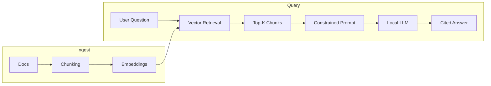
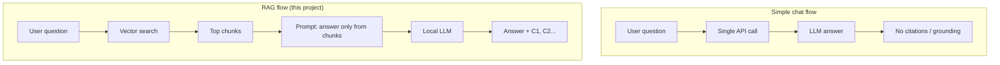

# infra-graphrag

**A locally hosted, citation-grounded DevOps documentation tutor built with Retrieval-Augmented Generation (RAG).**

This project ingests public Kubernetes documentation, converts it into embeddings, performs deterministic vector similarity search, and generates tutor-style answers using a locally hosted LLM (Ollama). All responses are grounded in retrieved evidence and include inline citations.

---

## Architecture



**Pipeline:** Docs → Chunking → Embeddings → Vector Retrieval → Constrained Prompt → Local LLM → Cited Answer

---

## Design Choices

How this project differs from a simple single-call chat API:

| Simple chat API | This project |
|-----------------|--------------|
| Single cloud API call | **Local model (Ollama)** — no data leaves the machine |
| Entire prompt sent to LLM | **Retrieval first** — only relevant chunks go to the LLM |
| Unconstrained answer | **Grounded generation** — answer restricted to provided evidence |
| No citations | **Citation discipline** — every claim references evidence (C1, C2…) |
| Opaque ranking | **Deterministic retrieval** — cosine similarity ranks evidence |



---

## Key Features

- **Semantic search** over infrastructure (e.g. Kubernetes) documentation  
- **Deterministic cosine similarity** retrieval  
- **Strict prompt-controlled generation** — model instructed to use only retrieved chunks  
- **Inline citation enforcement** (C1, C2, …)  
- **Local LLM hosting** — no external API calls; Ollama runs on the host machine  
- **Hallucination mitigation** via grounding rules  

---

## What This Project Is (and Isn't)

The project **does not** train or fine-tune any model; it does not modify model weights. It is a **retrieval + reasoning system** built around an off-the-shelf LLM: ingest docs → chunk → embed → retrieve by similarity → build a prompt from top chunks → generate with the LLM under strict “answer only from this context” instructions.

**Planned:** Knowledge Graph integration (GraphRAG-style).

---

## Summary

> A locally hosted, citation-grounded DevOps tutor that retrieves and explains Kubernetes documentation using deterministic vector search and constrained LLM generation.

---

## Tech / Concepts

- **Embeddings** (SentenceTransformers) — text → fixed-size vectors  
- **Vector similarity search** — cosine similarity over chunk embeddings  
- **Chunking** — overlapping text segments for retrieval  
- **RAG** — retrieve evidence first, then generate with an LLM  
- **Ollama** — local LLM hosting  

---

## Project Layout

```
infra_graphRAG/
├── apps/
│   ├── ingest/          # fetch.py (scrape docs), chunk.py (chunk → JSONL)
│   └── api/             # FastAPI: /search, /chat (RAG + citations)
├── data/
│   ├── raw/             # Fetched .txt (gitignored)
│   └── processed/       # chunks.jsonl (gitignored)
├── explore/             # Snippets for embeddings & cosine similarity
├── libs/
│   └── llm.py           # Ollama (or other) LLM client
├── .env.example         # Copy to .env and set OLLAMA_* etc.
└── README.md
```

---

## Quick Start

1. **Copy env and install dependencies**
   ```bash
   cp .env.example .env
   pip install fastapi uvicorn sentence-transformers numpy httpx pydantic pyyaml beautifulsoup4 requests
   ```

2. **Ingest docs** (run from project root)
   ```bash
   python apps/ingest/fetch.py
   python apps/ingest/chunk.py
   ```

3. **Run Ollama** (e.g. `ollama serve` and pull a model such as `llama3.1`).

4. **Start the API**
   ```bash
   uvicorn apps.api.main:app --reload
   ```
   - **Search only:** `POST /search` with `{"q": "...", "k": 5}`  
   - **RAG with citations:** `POST /chat` with `{"q": "..."}`  
   - **API docs:** http://127.0.0.1:8000/docs  

---

## License

See repository license file.
